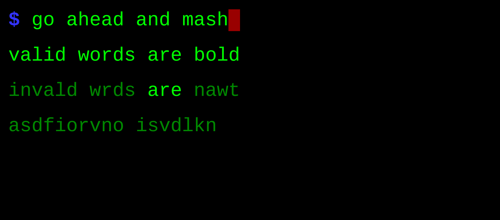
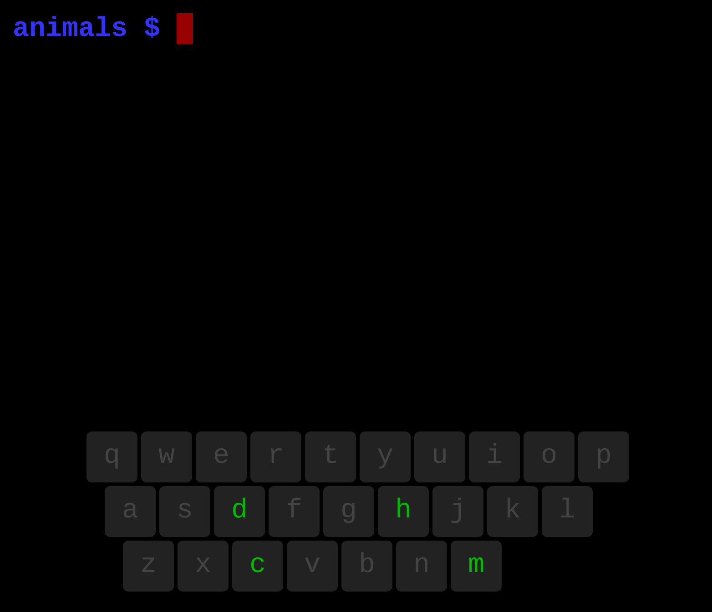
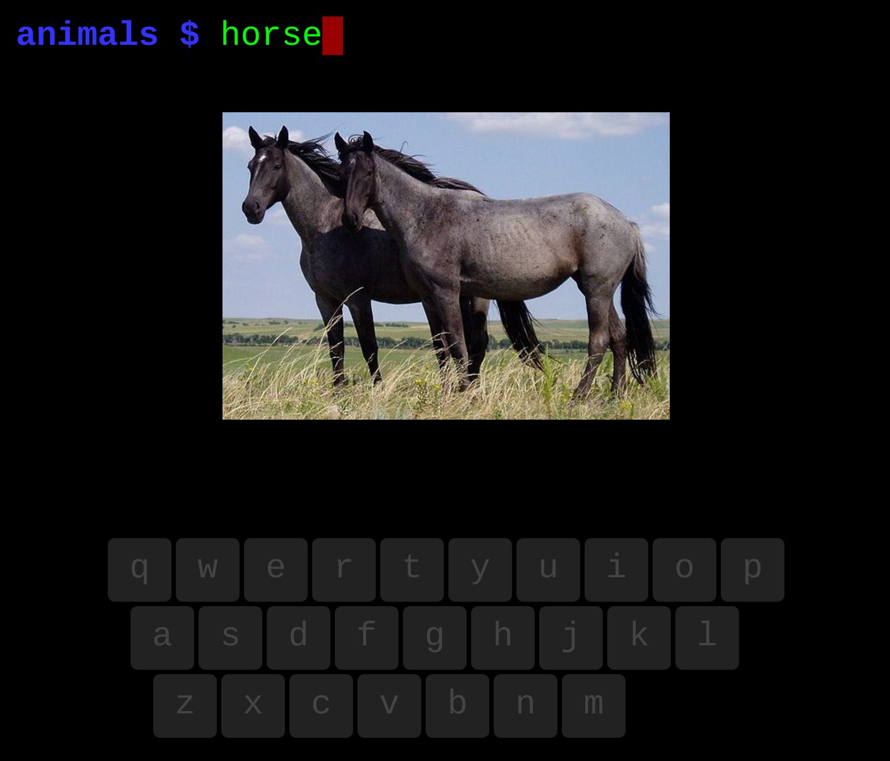

# mash-commander

The command-line shell for kids: https://mash-commander.appspot.com/

## Overview

Mash Commander is a command-line game for kids with an extremely low barrier to entry--just mash on the keyboard.  It drops kids into a world they can explore through the keyboard.  Curated sets of words and images guide children to learn by typing words in the command-line shell.  Discover commands, highlighted in blue, that make things happen!

### Freestyle mode

### Set mode

Type `animals` to explore the animal set.

## Features

- Simple interface.  No extra spaces.  No punctuation.  Just letters, numbers, space, backspace and enter.
- Correctly spelled words are highlighted--but mashing is still allowed.
- Enter pushes the current line onto the history stack.  Click or touch a line to bring it back.
- `clear` command clears the screen.
- Enter set mode by typing the name of a set.  E.g. `animals` or `alphabet`.

## Contributing

Wanna add something to Mash Commander?  Help me fill out one of the existing sets or create a new one!  Sets are easy to program, like [this](https://github.com/josephburnett/mash-commander/blob/master/resources/public/sets/animals/animals.json).  Then send me a pull request.

## Safety

By default, no information typed into Mash Commander goes over the network.  All of the code runs client-side in the browser.  Mash Commander can be run locally without a connection to the Internet if you want to set it up in a sandbox for your kids.

## History

This is an online version of [mash](https://github.com/josephburnett/mash) which my kids have been tinkering around with for a few years (ages 5 and 2).
