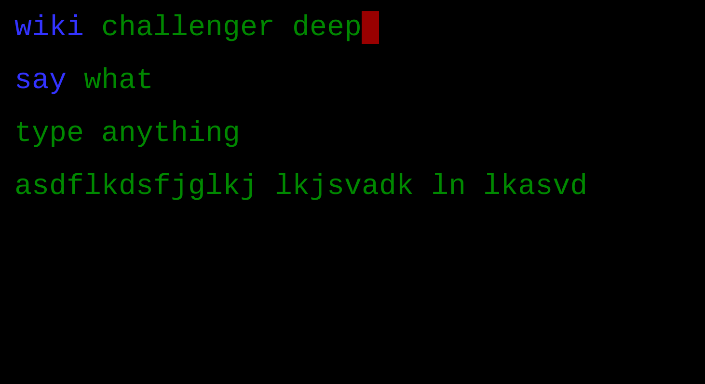

# mash-commander

The command-line shell for kids: https://mash-commander.appspot.com/

## Overview

Mash Commander is a command-line game for kids with an extremely low barrier to entry--just mash on the keyboard.  More sophisticated features can be discovered as kids play around.  E.g. word recognition, text-to-speech and information retrieval.

## Features

- Simple interface.  No extra spaces.  No punctuation.  Just letters, numbers, space, backspace and enter.
- Correctly spelled words are highlighted (work in progress), but mashing is still allowed.
- Enter pushes the current line onto the history stack.  Click or touch a line to bring it back.
- `clear` command clears the screen.
- `say` command speaks whatever you type.  E.g. `say i am a mash commander`  Wired to AWS Polly.  Requires AWS credentials with AmazonPollyReadOnlyAccess permission.  Stored in device local storage--never send off the client.  Hint: look at the console.
- `wiki` command does a Wikipedia search for whatever you type.  E.g. `wiki mars`  Speaks the intro of the first search result.
- `wolfram` command does a Wolfram Alpha Simple Answers API query.  E.g. `wolfram how big is the earth`  Speaks the answer.  Requires a free Wolfram Alpha app id.  (work in progress)

## Status

...working on it.

## History

This is an online version of [mash](https://github.com/josephburnett/mash) which my kids have been tinkering around with for a few years (ages 5 and 2).
